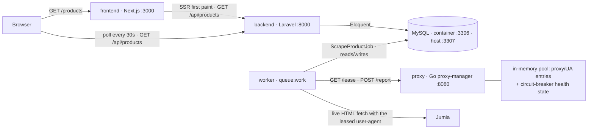

# Scraper trial task

Three services: a Next.js UI, a Laravel API that scrapes and stores products, and
a small Go service that owns proxy/user-agent identities and their health.



The lease/report loop runs in whichever process executes a live scrape job; with
a default `docker compose up` that is the `worker`. Fixture-mode scrapes take no
lease and make no request.

## Setup

One command from a fresh clone:

```bash
docker compose up --build
```

Then open **http://localhost:3000/products**.

The stack publishes four surfaces:

| URL | What it serves |
| --- | --- |
| `http://localhost:3000/products` | The UI: server-rendered first paint, then polled every 30s. |
| `http://localhost:8000/api/products` | The paginated JSON API, shaped `{ data, meta }`. |
| `http://localhost:8000/api/health` | Backend liveness. |
| `http://localhost:8080/metrics` | The Go proxy pool: every entry's failure count, cooldown and last-used time, plus leases issued and reports received. |

`/metrics` is where the lease/report loop is observable. Curl it, wait for the
queued live pass to run, then curl it again: `leases_issued` and
`reports_received` will have moved. If a live fetch is blocked, the failing
entry's `failures` climbs and it eventually shows a `cooldown_until` — that is
the circuit breaker working, not a bug.

The grid is populated from committed HTML fixtures during backend boot, so it is
never empty on first load. A second, queued pass then attempts a handful of live
Jumia fetches to exercise the lease/report loop — those may fail without
affecting the page (that is the point of the fallback).

MySQL is published on host port **3307**, not 3306: reviewers frequently already
have a local MySQL bound to 3306, and a port clash on first `docker compose up`
is the exact failure that makes someone abandon a submission. Inside the compose
network the container port is still 3306.

Each service has a `.env.example`; compose supplies the same values directly, so
no `.env` file needs to be created for the stack to run.

## Design decisions

### The Laravel ↔ Go lease/report loop

Before a live fetch, Laravel calls `GET /lease` on the Go service and gets back a
`{lease_id, proxy_url, user_agent}`. After the fetch it calls `POST /report` with
the outcome. Go scores each pool entry from those reports and benches the ones
that keep failing.

Proxy health is **state that has to survive across requests** — which entry
failed thirty seconds ago, how many times, how long it is benched for. PHP is
request-scoped: a process handles one request and dies, so it cannot hold that.
Go runs long-lived and keeps the pool in memory.

*Tradeoff:* two extra HTTP calls on the compose network per scrape
(sub-millisecond) and one more service to run and debug. The fallback below
means Laravel still scrapes if Go is down — it just loses health scoring and
rotation, so this is "in the path with a degraded fallback", not "hard
dependency".

### Circuit breaker, and where the attribution rule lives

Per `CONTRACTS.md` §3: `FAILURE_THRESHOLD` (3) **consecutive** proxy-attributable
failures bench an entry. Cooldown length is driven by how many times the entry
has been benched — 30s, 60, 120, 240, 480, capped at `COOLDOWN_MAX_SECONDS`
(600) — not by the raw failure count. When a cooldown expires the entry is
leaseable again but on probation: one more proxy-attributable failure re-benches
it immediately at the next step, without needing three.

Consecutive, not cumulative: any success resets the counter. Cumulative counting
slowly benches a healthy pool.

Only some outcomes count as proxy-attributable — status `0` (no response),
`403`, `407`, `408`, `429`, `502`, `503`, `504`. A `404` or `410` does not: that
is a bad URL, not a bad proxy, and counting it benches healthy entries. **This
rule lives in Go, not Laravel**, so there is one place to change it.

*Tradeoff:* with a small pool, aggressive benching can empty the rotation. When
every entry is cooling down, `GET /lease` returns `503` with a `Retry-After` and
Laravel falls back — an honest failure over ignoring the service's own health
data.

### Jumia is the only target

The task named sites by example ("Amazon, Jumia, etc."), so the list is not fixed
and a single working target is in scope. Every alternative was tried and rejected
on evidence (`CONTRACTS.md` §4):

- **Amazon** and **eBay** return `403` to a plain HTTP request, from both the
  container and the host.
- **Noon** renders prices client-side; the fetched HTML contains no product
  price.
- **Shein** serves a captcha challenge.
- **Jumia** serves the page with the price in the HTML.

The `SiteExtractor` interface and the host-based resolver are built for more than
one: a second site is one new file plus a one-line registration. There is one
because the others do not serve a price to a plain HTTP request — and this
project fetches HTML, it does not run a browser.

*Tradeoff:* one target looks thinner than three. Three half-working extractors
that break during review would read worse.

### The extractor reads JSON-LD, not CSS classes

Jumia publishes a schema.org `Product` as a JSON-LD `<script>` block on every
product page. The extractor reads `name`, `offers.price`, `offers.priceCurrency`,
`image` and `offers.availability` from that block. Jumia's visible CSS class
names are generated and churn; the JSON-LD is the stable surface.

The block is *located* with a dom-crawler CSS selector
(`script[type="application/ld+json"]`) and then JSON-decoded. The HTML is never
matched with a regular expression — regex breaks silently on any markup change
and has no concept of nesting.

An in-stock offer with no price **throws** rather than returning empty: a renamed
price field should show up as a spike in `failed_jobs`, not as every product
silently becoming null while jobs report success. A legitimately out-of-stock
page returns `null` and is skipped.

### `price` → `price_minor` + `currency` (deviation)

The task's field list is `id, title, price, image_url, created_at`. Stored
schema splits `price` into `price_minor` (`BIGINT UNSIGNED`, e.g. `1299900`) and
`currency` (`CHAR(3)`).

Binary floating point cannot represent `0.1` exactly, and the error compounds
when prices are summed across many rows. Money is stored as an integer count of
minor units and divided by 100 exactly once, in `ProductResource`, on the way
out. **The API still exposes `price` as a major-unit number** (`129.99`); the
frontend does no arithmetic on money at all.

`currency` is its own column because a bare `12999` is not data without its unit,
even though every row is `EGP` today. `source_url` is also added, `UNIQUE`, so
re-scraping is idempotent via `updateOrCreate`. Both deviations are the only
schema changes — no `description`, no `rating`; extra columns count against
"followed instructions" the same way missing ones do.

### `/metrics` returns JSON, not Prometheus exposition format

There is no Prometheus in the compose file, and a reviewer's only interaction
with the endpoint is `curl`. A readable JSON pool dump — each entry's failure
count, cooldown, last-used time — demonstrates the circuit breaker working. A
Prometheus text blob would demonstrate a convention. Some reviewers will expect
the exposition format; this is the trade.

### `images: { unoptimized: true }` in Next, no `remotePatterns` (deviation)

Three reasons, all in the comment in `frontend/next.config.ts`:

1. `output: "standalone"` *requires* `sharp` for image optimization, and on
   Alpine that pulls in `libc6-compat` — a native dependency and a classic
   first-run Docker failure.
2. Jumia's image URLs are already Thumbor-transformed to a fixed size.
   Re-optimizing an already-resized CDN thumbnail through our own server buys
   nothing.
3. With optimization on, every product image is proxied through the Next server
   out to Jumia's CDN, so a slow or unreachable Jumia fails at our server
   instead of in the visitor's browser.

`next/image` still gives lazy loading and reserved dimensions, so there is no
layout shift. With `unoptimized` set, Next skips the loader before
`remotePatterns` is ever consulted, so listing them would be dead config.

### Fixture mode

`SCRAPER_MODE=fixture` reads saved HTML from `backend/resources/fixtures/`
instead of making a request. It is not a stub: the same extractor, resolver,
price parser and `updateOrCreate` persistence path run — only the transport is
swapped. It exists so a clean clone produces products on first
`docker compose up` without depending on Jumia being reachable or unchanged.

## Known limitations

- **No JavaScript.** The scraper fetches HTML and reads it. A site that renders
  its price client-side returns a page with no price. Handling that needs a
  headless browser, which is out of scope.
- **Price parsing assumes Western digit grouping** (`1,234.56` — comma
  thousands, dot decimal). A European-format price (`1.234,56`) would parse to a
  silently wrong number rather than throwing. Jumia does not hit this.
- **A saved fixture cannot detect markup drift.** If Jumia changes its markup,
  live scraping breaks while fixture tests keep passing. `captured_at` in
  `backend/resources/fixtures/manifest.json` is what makes that staleness
  visible.
- **Pagination page is client state, not a `?page=` query parameter**, so a
  given page is not bookmarkable or shareable. Reading the param in the Server
  Component would mean a server round-trip per page change, which fights the
  polling the page exists for.
- **Failed scrapes land in `failed_jobs`.** A spike there is the signal that the
  markup changed. Alerting on Laravel's `Failed` job event is the natural next
  step and is deliberately not built.
- **A default `docker compose up` makes live requests to Jumia** — one throttled
  request per entry in `backend/config/scraping.php` `targets` (seven), after
  the offline fixture seed. `SCRAPER_SEED_LIVE=false` makes boot fully offline.
- **Live mode fetches from wherever the container runs**, so results depend on
  that network's reachability and its standing with the target site.
- **The build needs network access** to npm, Packagist, Docker Hub and
  `fonts.googleapis.com` — `next/font/google` fetches the Geist font at build
  time. This was hit for real during review; an air-gapped build will fail.

## Responsible scraping

- **Throttled.** `SCRAPER_THROTTLE_MS` (2000) between live requests — enough not
  to look like an attack and not to be rude.
- **robots.txt respected.** `RobotsChecker` fetches and checks it before a live
  fetch when `SCRAPER_RESPECT_ROBOTS` is true (the default); a disallowed path
  is skipped.
- **Public product data only** — title, price, currency, image URL, source URL.
  No accounts, no personal data, no content behind a login.
- **Built for evaluation.** A real deployment would not seed on boot, and would
  add alerting and a real proxy pool (drop entries into
  `proxy-manager/proxies.json` — the transport is already pluggable).

## Repository layout

| Path | What |
|---|---|
| `backend/` | Laravel API, scraper, extractors, queued job — see `backend/README.md` |
| `frontend/` | Next.js `/products` UI — see `frontend/README.md` |
| `proxy-manager/` | Go leasing + health service |
| `docker/` | compose-level notes |
| `CONTRACTS.md` | the frozen interfaces between the three services |
